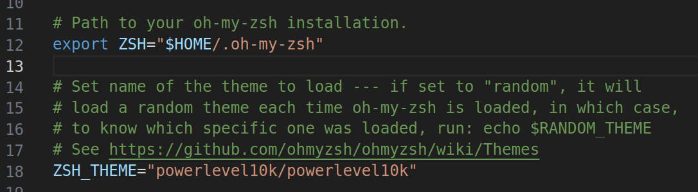
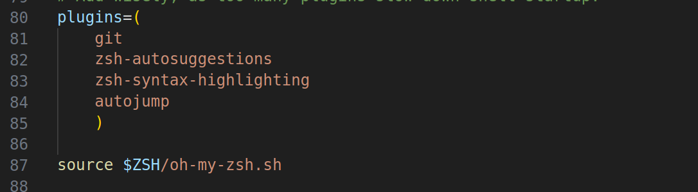

# linux-configuration

## gnome window common issue

### window top-right button lost

input command like this

```bash
gsettings set org.gnome.desktop.wm.preferences button-layout ':minimize,maximize,close'
```

or

```bash
gsettings set org.gnome.desktop.wm.preferences button-layout 'close,minimize,maximize:'
```

diff two diverse styles and choose what you like

---

### terminal configuration recommended

|  property  |             val             |
| :--------: | :-------------------------: |
|    col     |             90              |
|    line    |             24              |
| hightlight |            white            |
|   color    | green-char black-background |

### configure shell color

using `dircolors` command

```bash
cd ~
dircolors -p > .dircolors
```

edit .dircolors and select color what you like according to corresponding items

### using oh-my-zsh

clone *oh-my-zsh*

```bash
git clone https://github.com/robbyrussell/oh-my-zsh.git ~/.oh-my-zsh
```

or

```bash
sh -c "$(curl -fsSL https://raw.githubusercontent.com/robbyrussell/oh-my-zsh/master/tools/install.sh)"
```

change your shell to zsh

if you don't install zsh yet, using the following command

```bash
sudo apt install zsh
```

then

```bash
chsh -s /bin/zsh
```

which means you need logout for using zsh

```bash
cp ~/.oh-my-zsh/templates/zshrc.zsh-template ~/.zshrc
```

#### using template for zsh

```bash
git clone --depth=1 https://github.com/romkatv/powerlevel10k.git ${ZSH_CUSTOM:-$HOME/.oh-my-zsh/custom}/themes/powerlevel10k
```



in `.zshrc` you can add plugins



but then you need download above plugins from github or other websites

```bash
git clone https://github.com/zsh-users/zsh-syntax-highlighting.git ${ZSH_CUSTOM:-~/.oh-my-zsh/custom}/plugins/zsh-syntax-highlighting

git clone https://github.com/zsh-users/zsh-syntax-highlighting.git ${ZSH_CUSTOM:-~/.oh-my-zsh/custom}/plugins/zsh-syntax-highlighting
```

till now
